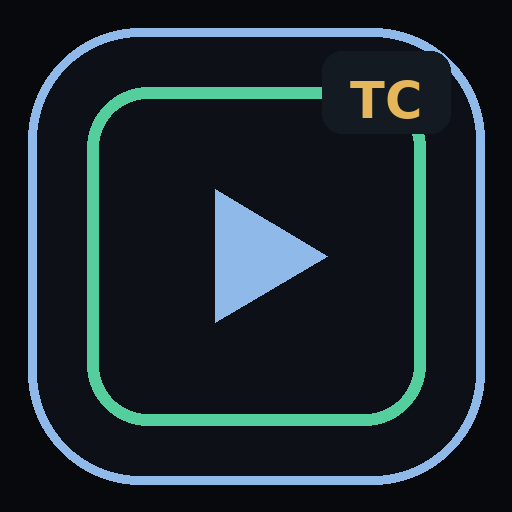

# TubeCraft Studio

<p align="center">
  
</p>

<h1 align="center">TubeCraft Studio</h1>
<p align="center"><strong>Professional installable PWA for AI video production</strong></p>
<p align="center">Script → scenes → generation → checkpoints → media → export</p>

TubeCraft Studio packages a professional PWA/web experience around the Agnes video-generation engine. The repository is prepared for a **GitHub → Vercel → PWA** workflow while keeping long-running video generation on a persistent Agnes engine.

> **Attribution:** the generation backend in this repository is based on the open-source Agnes Video Generator project. See `README_AGNES_ORIGINAL.md` and `LICENSE` for upstream details and attribution.

## Deployment model

```text
GitHub repository
       │
       ▼
     Vercel
       │
       ├── TubeCraft PWA
       └── same-origin /api/* rewrite
                 │
                 ▼
        Persistent Agnes Engine
          │            │
          ▼            ▼
       AI provider   FFmpeg/media workspace
```

The PWA is installable from Chrome/Edge on Android/desktop and supports Safari Add to Home Screen. The browser never receives the Agnes provider secret.

## GitHub → Vercel

Read **[`GITHUB_VERCEL_DEPLOY.md`](GITHUB_VERCEL_DEPLOY.md)** for the exact deployment sequence.

The Vercel configuration expects one environment variable:

```text
TUBECRAFT_BACKEND_URL=https://YOUR-AGNES-BACKEND.example.com
```

The value should be the HTTPS base URL of your persistent Agnes engine. Vercel forwards `/api/*` through the same public domain, which avoids exposing a separate backend URL to normal browser code and avoids CORS setup in the PWA.

## PWA identity

- **App name:** TubeCraft Studio
- **Short name:** TubeCraft
- **Display:** standalone
- **Scope:** `/`
- **Theme:** `#07090C`
- **Icons:** 192×192, 512×512, 180×180 Apple icon, favicon
- **Service worker:** root-scoped and update-aware
- **Offline:** app shell fallback
- **Install prompt:** supported browsers + iOS guidance

## Real video generation

TubeCraft's self-test can validate the local media pipeline with a real synthetic MP4 and can run a live generation test against an authenticated Agnes engine.

A live generation test needs the Agnes backend/provider configured with its own `AGNES_API_KEY`. That secret must stay on the backend and must never be committed to GitHub or exposed through a `VITE_*` variable.

## Development

Local engine:

```bash
./start.sh
```

Frontend development:

```bash
cd frontend
npm install
npm run dev
```

Production frontend build used by Vercel:

```bash
cd frontend
npm ci
npm run build:vercel
```

## Verification

```bash
python scripts/check_vercel_release.py
python -m compileall -q server.py core web self_test.py
python -m pytest -q tests/test_tubecraft_pwa_assets.py tests/test_tubecraft_pwa_hardening.py tests/test_tubecraft_access_control.py tests/test_tubecraft_self_test.py
```

## License / upstream

The backend retains the upstream project's license and attribution. Review `LICENSE` and `README_AGNES_ORIGINAL.md` before publishing a fork under a different brand or organization.
